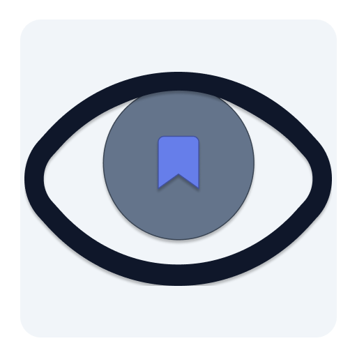

  

<h1 align="center">Vision Marks</h1>

  <strong>A modern, personal vision board for your bookmarks.</strong> 
  Lightweight PWA that transforms how you collect, organize, and interact with your favorite links.

  <a href="#-key-features">Features</a> •
  <a href="#-personalization--style">Personalization</a> •
  <a href="#-offline--pwa">Offline & PWA</a> •
  <a href="#-local-storage--limitations">Local Storage & Limitations</a> •
  <a href="#-upcoming-roadmap">Roadmap</a> •
  <a href="#-credits">Credits</a> •
  <a href="#-license">License</a>

  
  
  
  
  

  
   
  <em>Desktop layout with active folders and widgets</em>

---

## 👁️ **What is Vision Marks?**

Vision Marks is more than a simple bookmark manager. It is a **lightweight, personal vision board** inspired by the concept of surrounding yourself with visual and organized cues to manifest your goals.

It moves beyond static lists. Here, your saved links, folders, and widgets become a curated dashboard for your projects, learning, and daily inspiration. The project emphasizes **complete visual freedom** and **performance**, ensuring your digital space is both inspiring and instantly responsive, whether you're on a powerful desktop or a mobile phone.

 

## **Key Features**

| Area | Description |
| :--- | :--- |
| **Smart Bookmarking** | Full CRUD operations, automatic favicon fetching with a robust fallback chain, and a powerful real-time search engine with keyboard shortcuts (Supports `Ctrl+K`, `/`). |
| **Folder Management** | Create nested structures to categorize your interests. Supports custom **emoji** or **personal SVG** icons for each folder. |
| **Optional AI Assistant** | An integrated, privacy-minded AI chat (powered by Groq, OpenAI, Gemini, etc.) that can intelligently search, recommend, and categorize your existing bookmarks. Uses local storage for API keys. |
| **Modular Widgets** | Enhance your vision board with 4 built-in widgets:   • **Photo Grid:** For a classic visual vision board.   • **Recent Bookmarks:** Quickly access your latest saves.   • **Daily Quote:** Fetches inspiring daily phrases from an external API.   • **Goal Tracker:** Simple counter for personal objectives. |
| **Import/Export** | Full compatibility with standard browser HTML bookmarks. Import/export your data seamlessly for backups or migration. |

 

## **Personalization & Style**

This is the core of Vision Marks. Your dashboard is yours to design:
- **Themes:** Choose from `Light`, `Dark`, `AMOLED`, `Auto` (system-based), or create a completely `Custom` color scheme.
- **Layouts:** Select from predefined layouts (`Double`, `Extended`, `Widgets`) to arrange your modules.
- **Typography:** Select your preferred font family for the entire interface.
- **Custom Icons:** Upload your own **SVG icons** to replace default emojis for a truly unique folder structure.
- **Container Colors:** Customize the background color of individual containers (e.g., the chat box or folder grid).

> All your settings are saved locally and persist instantly.

 

## **Offline & PWA**

Vision Marks is a fully functional **Progressive Web App (PWA)**. This means you can:

- **Install it** on your device's home screen (PC, Android, iOS).
- **Use it offline** after the first visit, as all core logic and your saved data are cached locally via a Service Worker.
- Benefit from **fast loading times** and an app-like experience without the need for an app store.

 

## **Local Storage & Limitations**

> **🔒 100% Local-First. Your data, your control.**

Vision Marks operates entirely on your device. **No cloud, no servers, no tracking.** All your bookmarks, folders, settings, widget data, and even uploaded images are stored exclusively in your browser's **IndexedDB** and **localStorage**.

This approach guarantees speed, privacy, and offline functionality, but comes with natural limitations imposed by the browser:

| Aspect | Limitation | Practical Impact |
| :--- | :--- | :--- |
| **Total Storage** | Browser-dependent (typically **5MB–250MB+**). | ~50–200 bookmarks with rich icons, or a moderate photo grid. |
| **Photo Grid Images** | Base64-encoded images stored directly in IndexedDB. | Recommended to keep images under **2MB each** and a maximum of **9 images** per widget to avoid performance issues. |
| **Favorites Limit** | Hard limit of **32 favorites** (configurable). | Encourages curation of truly important links. |
| **AI Chat History** | Last **50 messages** are saved. | Older conversations are automatically pruned to save space. |
| **Custom SVG Icons** | Maximum of **30 custom icons**. | Prevents storage bloat from large SVG files. |

> **Why these limits?** Vision Marks is designed for **speed** and **efficiency**. Unlike cloud-based services that store data on external servers, your browser has physical limits. These restrictions ensure the app remains lightning-fast and responsive, even with hundreds of bookmarks.

 

## **Upcoming Roadmap**

- **Free Layout with Muuri:** The next major step is implementing a fully **drag-and-drop, free-form layout** using the powerful [Muuri](https://github.com/haltu/muuri) library. This will allow you to position containers (folders, bookmarks, widgets) anywhere on a canvas.
- **P2P Synchronization:** Enable seamless, account-less synchronization of your bookmarks across different devices (PC, Mobile) using peer-to-peer technology.
- **Internationalization (i18n):** Full translation support for multiple languages to make Vision Marks accessible worldwide.

 

## **Credits**

- **[Muuri](https://github.com/haltu/muuri):** The incredible, responsive, sortable, filterable and draggable layout engine that will power our upcoming free-form canvas.
- **[The Positive API](https://www.positive-api.online/):** A lovely, free and open API providing daily positive and inspiring quotes in Spanish, used by our `Daily Quote` widget. Created by **Heartenic**.
- **All Contributors:** A special thanks to everyone who has starred, reported issues, or contributed to the project.

 

## **License**

This project is licensed under the **MIT License** See the [`LICENSE`](./LICENSE) – a permissive, open-source license that allows you to freely use, modify, distribute, and sublicense the software, provided you include the original copyright notice.
